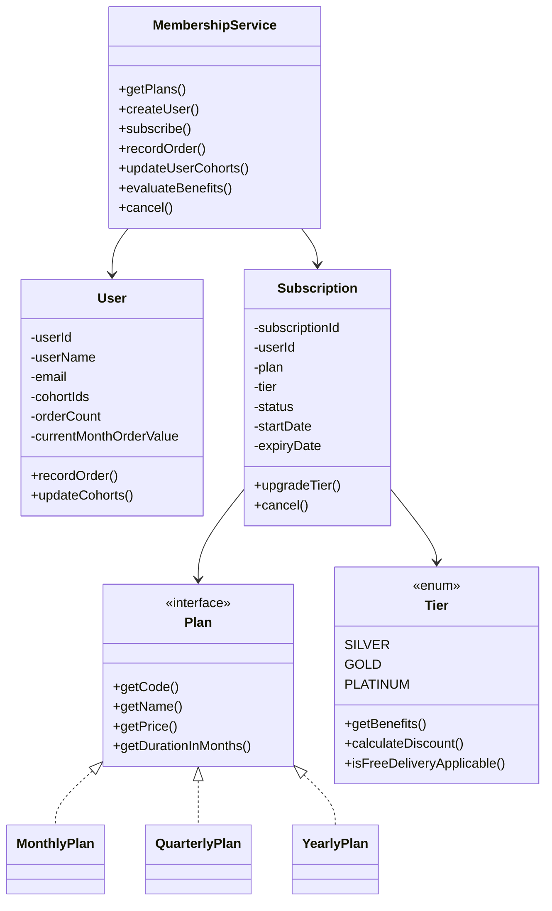

# Membership Program

Small Java LLD/demo for the membership program described in the PDF.

This is intentionally scoped to the problem statement. It is not designed as a production-grade service. The goal is to show clean classes, basic extensibility, functional APIs, and a runnable demo.

## Requirements Covered

- User can view Monthly, Quarterly, and Yearly membership plans.
- User subscribes to a plan.
- New subscription starts with Silver tier by default.
- Tier upgrades happen automatically when user metrics change.
- Tier criteria use order count, monthly order value, and user cohort.
- Membership benefits include free delivery, discount, exclusive deals, and priority support.
- APIs are functional and demo-able.

## Assumptions

- User selects only the plan, not the tier.
- Silver is the default tier for every new subscription.
- Gold/Platinum are system-assigned based on user activity.
- Current month order value is stored on `User` for this demo.
- This demo supports upgrades only. Downgrade logic can be added later if needed.
- In-memory maps are used instead of a database.
- `synchronized` service methods are used for simple concurrency safety in this demo.

## Plans

| Plan | Duration | Price |
| --- | ---: | ---: |
| Monthly | 1 month | INR 199 |
| Quarterly | 3 months | INR 549 |
| Yearly | 12 months | INR 1999 |

## Tiers

| Tier | Eligibility | Benefits |
| --- | --- | --- |
| Silver | Default | Free delivery above INR 499, 5% discount |
| Gold | 10 orders or INR 5000 monthly order value | Free delivery above INR 299, 10% discount, exclusive deals |
| Platinum | 30 orders, INR 15000 monthly order value, or premium cohort | Free delivery, 15% discount, exclusive deals, priority support |

## LLD



## Main Classes

| Class | Purpose |
| --- | --- |
| `Plan` | Interface for membership plans |
| `MonthlyPlan`, `QuarterlyPlan`, `YearlyPlan` | Concrete plan implementations |
| `Tier` | Enum for Silver, Gold, Platinum and their benefits |
| `User` | Stores user details and simple membership metrics |
| `Subscription` | Active membership state for a user |
| `MembershipService` | Handles plan listing, subscription, tier upgrades, benefits, and cancellation |
| `MembershipApiServer` | Thin HTTP layer for demo APIs |

## Run

```bash
make demo
```

Expected output:

```text
Demo passed: subscribe with Silver, upgrade to Gold, upgrade to Platinum, evaluate benefits, cancel.
```

Start APIs:

```bash
make run PORT=8080
```

## APIs

### Health

```bash
curl http://localhost:8080/health
```

### Get Plans

```bash
curl http://localhost:8080/membership/plans
```

### Get Tiers

```bash
curl http://localhost:8080/membership/tiers
```

### Create User

```bash
curl -X POST http://localhost:8080/users \
  -H "Content-Type: application/json" \
  -d '{"userId":"U1","userName":"Sambhav","email":"sambhav@example.com"}'
```

### Subscribe

```bash
curl -X POST http://localhost:8080/users/U1/membership/subscribe \
  -H "Content-Type: application/json" \
  -d '{"planCode":"YEARLY"}'
```

### Record Order

Record 10 orders of INR 500 to move from Silver to Gold.

```bash
curl -X POST http://localhost:8080/users/U1/orders \
  -H "Content-Type: application/json" \
  -d '{"amount":500}'
```

### Update Cohort

Premium cohort can move user to Platinum.

```bash
curl -X POST http://localhost:8080/users/U1/cohorts \
  -H "Content-Type: application/json" \
  -d '{"cohortIds":["PREMIUM"]}'
```

### Get Membership

```bash
curl http://localhost:8080/users/U1/membership
```

### Evaluate Benefits

```bash
curl -X POST http://localhost:8080/users/U1/membership/benefits/evaluate \
  -H "Content-Type: application/json" \
  -d '{"orderAmount":2000,"category":"ELECTRONICS","deliveryEligible":true}'
```

### Cancel

```bash
curl -X POST http://localhost:8080/users/U1/membership/cancel
```

## Extending Later

- Add another plan by implementing `Plan`.
- Add another tier by extending the `Tier` enum or replacing it with tier classes if rules become complex.
- Move user metrics out of `User` if order service/database is introduced.
- Replace in-memory maps with repositories when persistence is needed.
